># ToDo Application

## Seema Shrestha (C7227262)
***
 

## MY TODO APPLICATION
 

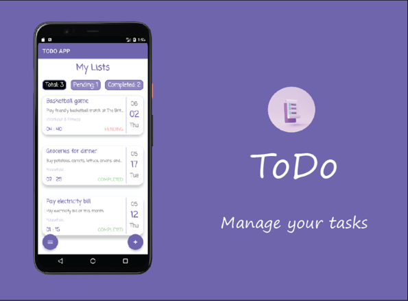

***
 

## FRAMEWORK OF THE APPLICATION
 

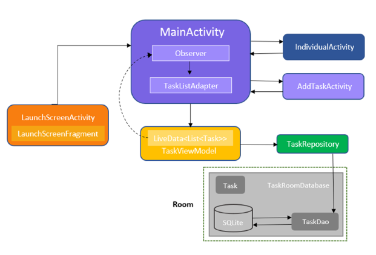

***
 

## APPLICATION ICON
 

***
 

## PORTRAIT VARIATION OF THE APPLICATION
 

Launch / Splash Screen            |  Display Task List
:-----------------------------:|:-----------------------------:
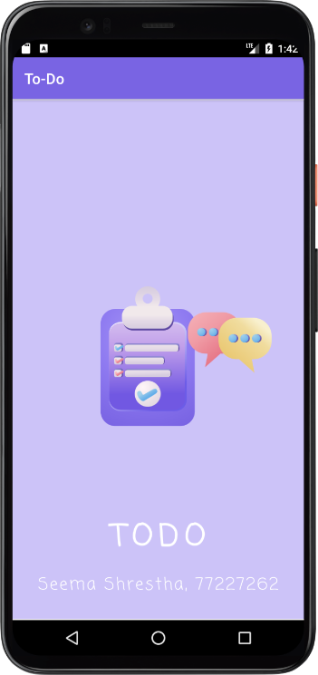  |  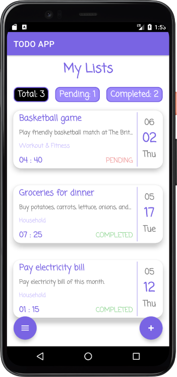

 

Display Single Task            |  Add Task
:-----------------------------:|:-----------------------------:
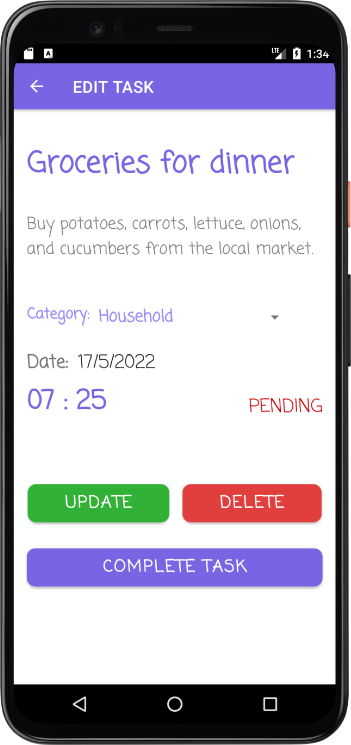  |  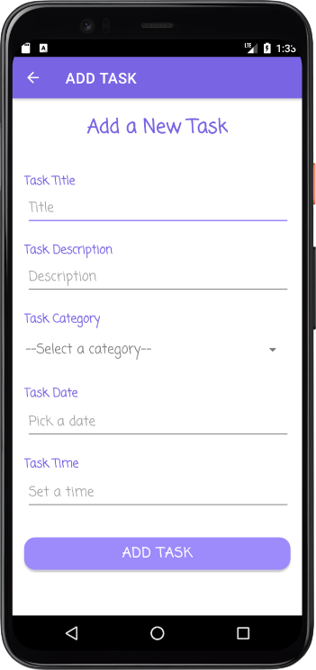

 

Edit Task            |  Menu Option
:-----------------------------:|:-----------------------------:
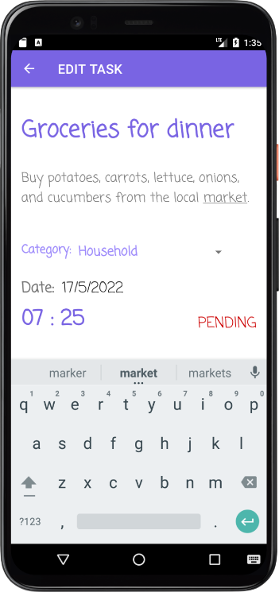  |  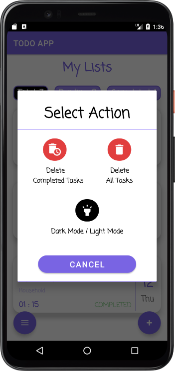

***
 

## LANDSCAPE VARIATION OF THE APPLICATION

#### ScrollView has been implemented in most of the pages. 

 

### Launch / Splash Screen            

.png)

 

### Display Task List

.png)

 

### Display Single Task

.png)

 

### Add Task

.png)

 

### Edit Task

.png)

 

### Menu Option
.png)

***
 

## DARK THEME OF THE APPLICATION
 

Launch / Splash Screen            |  Display Task List
:-----------------------------:|:-----------------------------:
.png)  |  .png)

 

Display Single Task            |  Add Task
:-----------------------------:|:-----------------------------:
.png)  |  .png)

 

Edit Task            |  Menu Bar Option
:-----------------------------:|:-----------------------------:
.png)  |  .png)

***
 

## TABLET VARIATION OF THE APPLICATION
 

Launch / Splash Screen            |  Display Task List
:-----------------------------:|:-----------------------------:
.png)  |  .png)

 

Single Task            |  Add Task
:-----------------------------:|:-----------------------------:
.png)  |  .png)

 

Edit Task            |  Menu Option
:-----------------------------:|:-----------------------------:
.png)  |  .png)

***
 

## FEATURES OF MY APPLICATION
 **1. Basic Features**
  * Displaying Task List (Homepage)
  * Displaying Single Task
  * Adding Task 
  * Editing Task 
  * Deleting Task
  * Changing the status of a task to completed
  * Validating the input fields 
  * Landscape Variation 

 **2. Additional Features**
  * Application Icon
  * Application Launching Screen
  * Swiping Left to Delete a Task
  * Swiping Right to Complete a Task
  * Filtering the Task List
  * Deleting Completed Task
  * Deleting All Task
  * Undo with the help of Snackbar
  * Dark Mode / Light Mode Theme
  * Tablet Variation

***
 

## BASIC FEATURES 
 

### Displaying Task List
 

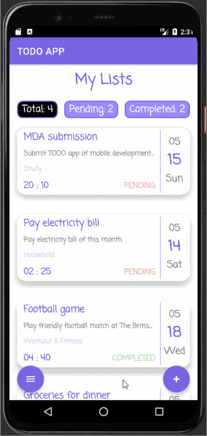

 

### Displaying Single Task

#### Each individual task can be displayed by clicking on the task title.
 

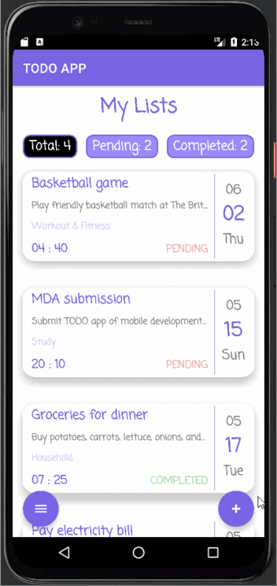

 

### Adding Task
 

 

### Editing Task
 

 

### Deleting Task
 

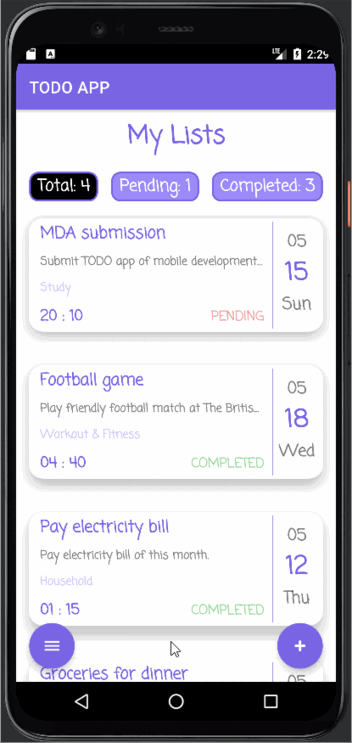

 

### Completing Task
 

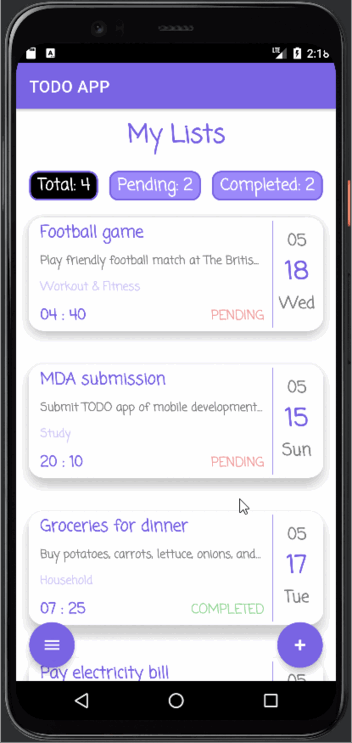

 

### Validating Input Fields

#### A task cannot be added or updated if any of the input fields is empty.
 

***
 

## ADDITIONAL FEATURES 
 

### Application Launching Screen
 

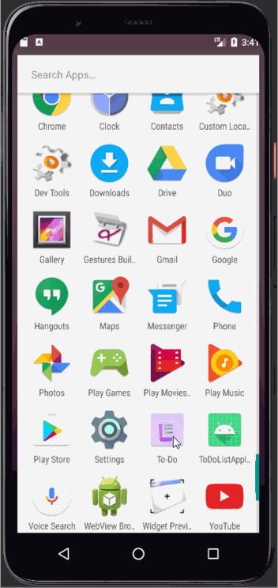

 

### Swiping Left

#### A specific task can be deleted by swiping left.
 

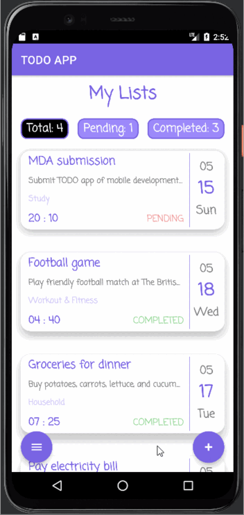

 

### Swiping Right

#### A specific task can be completed by swiping right.
 

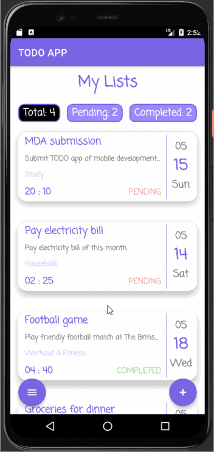

 

### Filtering Task List

#### Task lists can be filtered as total, pending, and completed tasks. 
 

 

### Deleting Completed Tasks
 

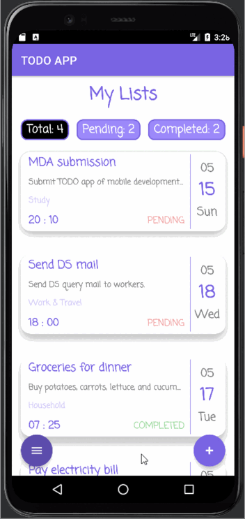

 

### Deleting All Tasks
 

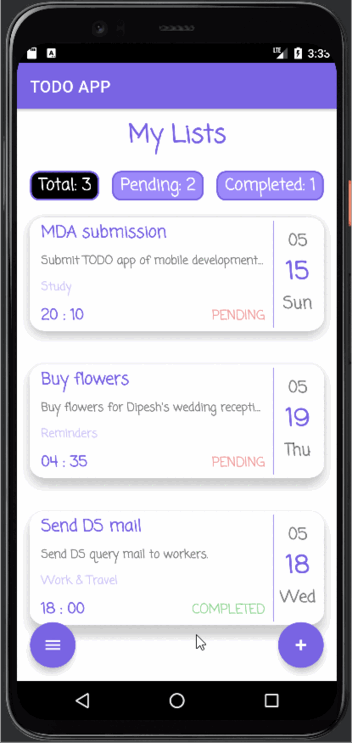

 

### Undo Action (Snackbar)

#### A deleted task can be restored.
 

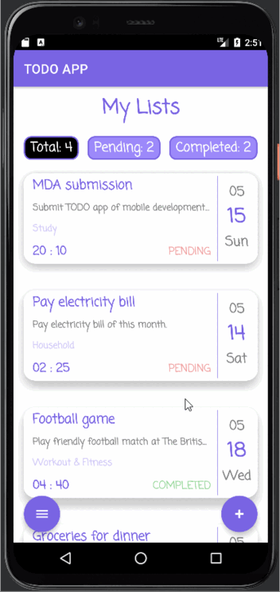

 

### Dark Mode Version 

#### A theme of the app can be changed to dark or light mode from the menu option. After a theme is applied, it's state is saved each time the application is closed and restarted. 
 

 

***